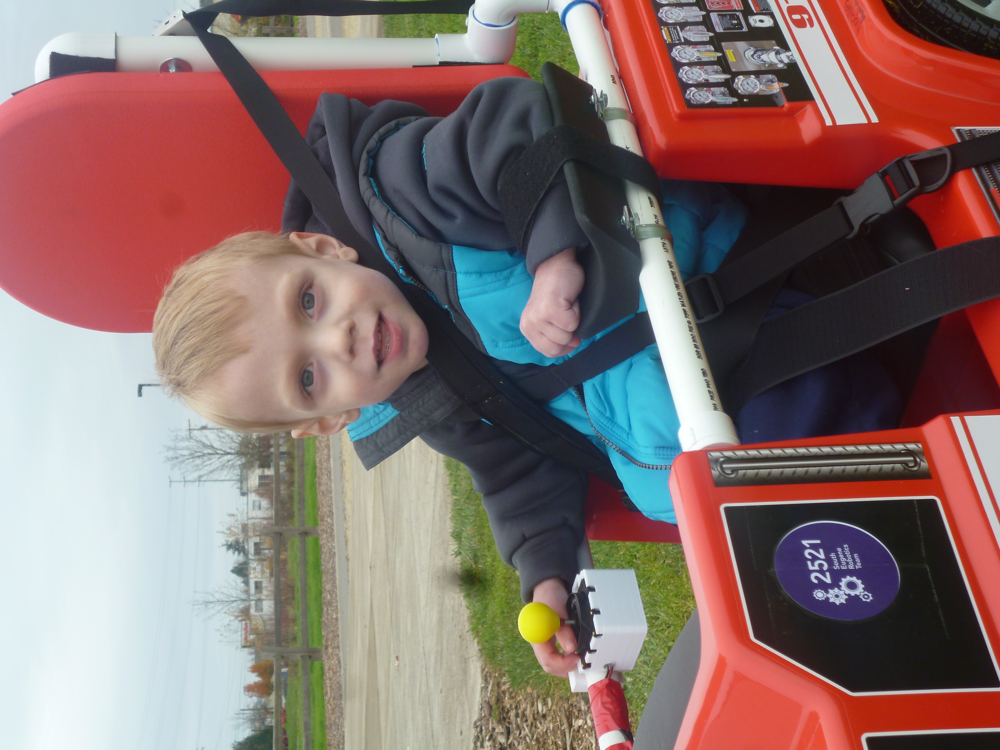

# Links to instructions and software for "go baby go" ride on cars modified to have joystick control.

# Instructions

firetruck: [https://drive.google.com/drive/folders/0B2HJnUrZAwYremFIYW55LVZ2TUU?resourcekey=0-zuVXEhaKQ2dVb-dyiEhITQ](https://drive.google.com/drive/folders/0B2HJnUrZAwYremFIYW55LVZ2TUU?resourcekey=0-zuVXEhaKQ2dVb-dyiEhITQ)

jeep: [https://www.instructables.com/GoBabyGo-Make-a-Joystick-controlled-Ride-on-Car/](https://www.instructables.com/GoBabyGo-Make-a-Joystick-controlled-Ride-on-Car/)

generalized circuit diagram: [https://docs.google.com/drawings/d/1BKDrhKLFc0Y3o9NzUfYC5lIbI_fWCTx9kLZsG5Ts-0o/view](https://docs.google.com/drawings/d/1BKDrhKLFc0Y3o9NzUfYC5lIbI_fWCTx9kLZsG5Ts-0o/view)

# Software

web programmer: [https://gobabygocarswithjoysticks.github.io/programmer/](https://gobabygocarswithjoysticks.github.io/programmer/)

old code: [https://github.com/gobabygocarswithjoysticks/classic](https://github.com/gobabygocarswithjoysticks/classic)

# CAD

## Joystick Balls (handle)

* Large: [download STL](https://github.com/gobabygocarswithjoysticks/index/raw/main/ball-large.stl), [CAD on Onshape](https://cad.onshape.com/documents/0606b7a44a156562463230b4/w/c157c0319d8b261b7ab62dff/e/b75fad568b60fe3b0a1b6ac1), [view on github](https://github.com/gobabygocarswithjoysticks/index/blob/main/ball-large.stl)
 
* Medium: [download STL](https://github.com/gobabygocarswithjoysticks/index/raw/main/ball-medium.stl), [CAD on Onshape](https://cad.onshape.com/documents/0606b7a44a156562463230b4/w/c157c0319d8b261b7ab62dff/e/d88b555d9c6e3a457df8af72), [view on github](https://github.com/gobabygocarswithjoysticks/index/blob/main/ball-medium.stl)

* Large: [download STL](https://github.com/gobabygocarswithjoysticks/index/raw/main/ball-small.stl), [CAD on Onshape](https://cad.onshape.com/documents/0606b7a44a156562463230b4/w/c157c0319d8b261b7ab62dff/e/5374dfde2b557ee7c8b2d179), [view on github](https://github.com/gobabygocarswithjoysticks/index/blob/main/ball-small.stl)

## Joystick Holder

* [Bottom](https://github.com/gobabygocarswithjoysticks/index/raw/main/joy-holder-bottom.stl)

* [Lid](https://github.com/gobabygocarswithjoysticks/index/raw/main/joy-holder-lid.stl)

* [Clamp](https://github.com/gobabygocarswithjoysticks/index/raw/main/joy-holder-clamp.stl)

[Onshape](https://cad.onshape.com/documents/6cf557827fa40e994b5bc5d8/w/0248049be91a11ab1b1efe99/e/c3181b8155bb2d289a3a4906)

# Photos

## firetruck

## jeep

---
This webpage is on github here: [https://github.com/gobabygocarswithjoysticks/index](https://github.com/gobabygocarswithjoysticks/index)
