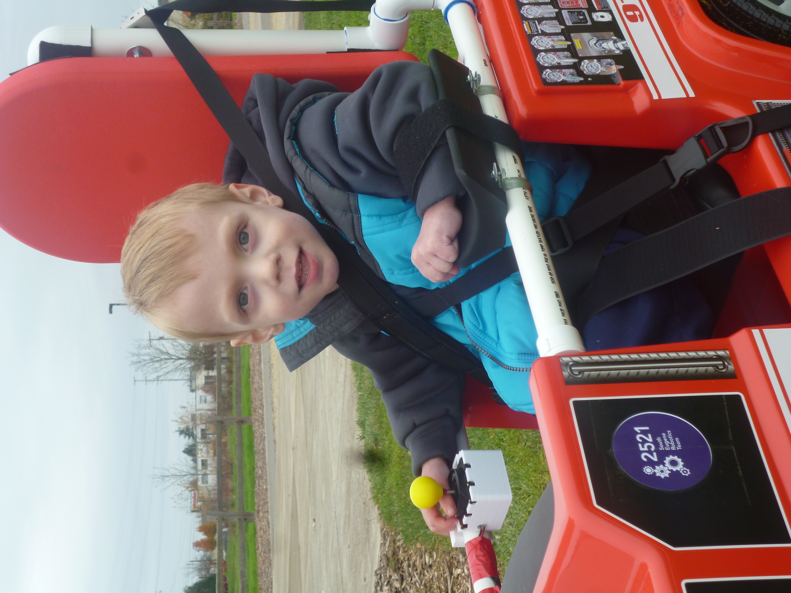

# Links to instructions and software for [Go Baby Go](https://health.oregonstate.edu/gobabygo) inspired ride on cars modified to have joystick control.

# Instructions

## jeep: 
[https://www.instructables.com/GoBabyGo-Make-a-Joystick-controlled-Ride-on-Car/](https://www.instructables.com/GoBabyGo-Make-a-Joystick-controlled-Ride-on-Car/)

## firetruck: 
[https://drive.google.com/drive/folders/0B2HJnUrZAwYremFIYW55LVZ2TUU?resourcekey=0-zuVXEhaKQ2dVb-dyiEhITQ](https://drive.google.com/drive/folders/0B2HJnUrZAwYremFIYW55LVZ2TUU?resourcekey=0-zuVXEhaKQ2dVb-dyiEhITQ)

## generalized circuit diagram: 
[https://docs.google.com/drawings/d/1BKDrhKLFc0Y3o9NzUfYC5lIbI_fWCTx9kLZsG5Ts-0o/view](https://docs.google.com/drawings/d/1BKDrhKLFc0Y3o9NzUfYC5lIbI_fWCTx9kLZsG5Ts-0o/view)

# Questions or comments?
### Please post [here](https://github.com/gobabygocarswithjoysticks/index/discussions/categories/support-and-troubleshooting) or email us at gobabygocarswithjoysticks@gmail.com

# Software

## web programmer: [https://gobabygocarswithjoysticks.github.io/programmer/](https://gobabygocarswithjoysticks.github.io/programmer/)

new car code (uploaded by web programmer): [https://github.com/gobabygocarswithjoysticks/car-code](https://github.com/gobabygocarswithjoysticks/car-code)

old code: [https://github.com/gobabygocarswithjoysticks/classic](https://github.com/gobabygocarswithjoysticks/classic)

# CAD

## [Joystick Balls](https://github.com/gobabygocarswithjoysticks/index/tree/main/joystick-balls) (handle)

* [Large](https://github.com/gobabygocarswithjoysticks/index/raw/main/joystick-balls/ball-large.stl)
 
* [Medium](https://github.com/gobabygocarswithjoysticks/index/raw/main/joystick-balls/ball-medium.stl)

* [Small](https://github.com/gobabygocarswithjoysticks/index/raw/main/joystick-balls/ball-small.stl)

[Onshape](https://cad.onshape.com/documents/0606b7a44a156562463230b4/w/c157c0319d8b261b7ab62dff/e/5374dfde2b557ee7c8b2d179) (make a copy of the model to make custom sizes!)

## [Joystick Holder](https://github.com/gobabygocarswithjoysticks/index/tree/main/joystick-holder)

* [Bottom](https://github.com/gobabygocarswithjoysticks/index/raw/main/joystick-holder/joy-holder-bottom.stl)

* [Lid](https://github.com/gobabygocarswithjoysticks/index/raw/main/joystick-holder/joy-holder-lid.stl)

* [Clamp](https://github.com/gobabygocarswithjoysticks/index/raw/main/joystick-holder/joy-holder-clamp.stl)

* [Clip](https://github.com/gobabygocarswithjoysticks/index/raw/main/joystick-holder/joy-holder-clip.stl) (optional, limits joystick to forwards and backwards only)

[Onshape](https://cad.onshape.com/documents/b635ac829ab39856feba8a99/w/07b70b7662805e9b51c5965c/e/4f736c40741061401f9fab29)

## [PVC Tees](https://github.com/gobabygocarswithjoysticks/index/tree/main/pvc-tee)

[PVC Saddle Tee part 1](https://github.com/gobabygocarswithjoysticks/index/raw/main/pvc-tee/saddle-tee-part-1.stl)

[PVC Saddle Tee part 2](https://github.com/gobabygocarswithjoysticks/index/raw/main/pvc-tee/saddle-tee-part-2.stl)

---

# GBG-PCB
### [A circuit board for making joystick cars without any soldering](https://github.com/gobabygocarswithjoysticks/gbg-pcb)

### [General instructions for using a GBG-PCB](https://gobabygocarswithjoysticks.github.io/gbg-pcb/instructions/instructions)

### [jeep](https://gobabygocarswithjoysticks.github.io/gbg-pcb/instructions/car-specific/aosom-038-jeep/instructions)

### [bumper car](https://gobabygocarswithjoysticks.github.io/gbg-pcb/instructions/car-specific/zupapa-bumper-car/instructions)

# Photos

## [firetruck](https://drive.google.com/drive/folders/0B2HJnUrZAwYremFIYW55LVZ2TUU?resourcekey=0-zuVXEhaKQ2dVb-dyiEhITQ)

## [jeep](https://www.instructables.com/GoBabyGo-Make-a-Joystick-controlled-Ride-on-Car/)

---
This webpage is on github here: [https://github.com/gobabygocarswithjoysticks/index](https://github.com/gobabygocarswithjoysticks/index)
