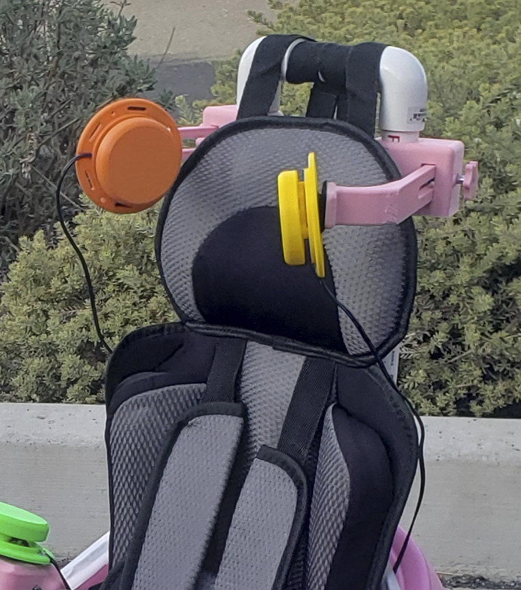
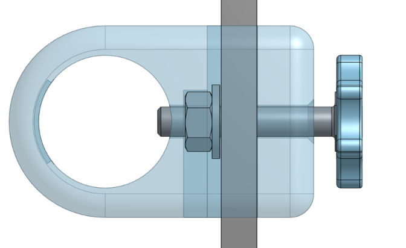
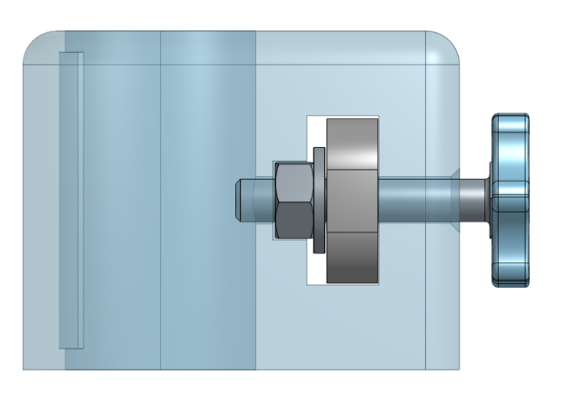
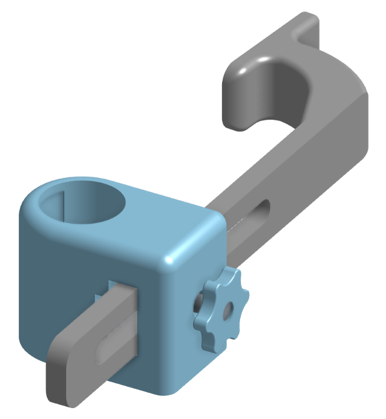

# Headrest Button Holder
Adjustible arms that hold buttons near the headrest.

## 3D printed parts
* [arm](/headrest-button-holder/arm.stl)
* [holder](/headrest-button-holder/holder.stl)
* [handwheel](/headrest-button-holder/1-4-20%20handwheel.stl)

## Hardware

* 1/4-20 x1.5 inch Hex bolt
* 1/4-20 Hex nut
* 1/4 inch washer
* 40mm x 17mm x 1/16in rubber sheet

## Onshape
https://cad.onshape.com/documents/42a941c5734248f24522bb47/w/83b7a18f64140e48851c8664/e/eff2c09c1abfb37dfca79259?renderMode=0&uiState=6a94d740e186185b9ef80651 
